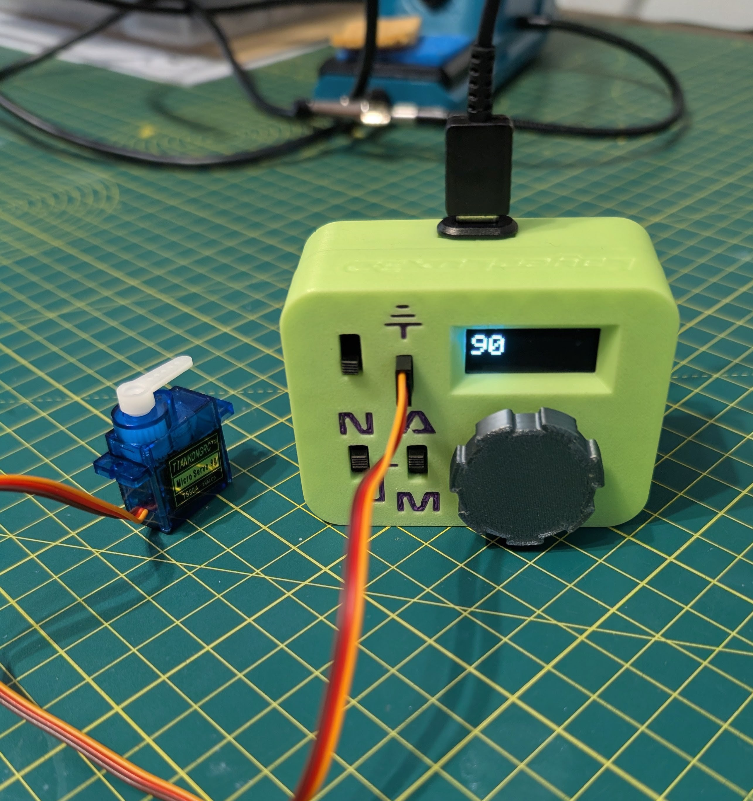

# 🛠️ ESP32 Servo Tester

## 🔍 Overview



Compact ESP32-C3 based servo tester with an EC11 rotary encoder, on‑screen angle display (0.91" I2C OLED), smooth eased motion, and tap-to-cycle angle increment (1° → 5° → 10°). The dial was remodelled to properly fit the encoder shaft – see `RemodelledDial.3mf`.


MakerWorld model (enclosure / original design reference):  
https://makerworld.com/en/models/884319-servo-tester#profileId-839093  
Design credit for the base enclosure concept: https://makerworld.com/en/@LayerLux3D

<br>

## 🧩 Hardware

| Purpose | Part / Description | Link |
|---------|--------------------|------|
| Microcontroller | ESP32-C3 Dev Board (GPIO numbers reflect C3 mapping) | https://www.amazon.co.uk/diymore-ESP32-C3-Development-Bluetooth-Projects/dp/B0DS23ML1L?th=1 |
| Rotary Encoder | EC11 360° rotary encoder w/ push switch (15mm shaft) (5 pcs pack) | https://www.amazon.co.uk/dp/B07R8G2WWH?ref=ppx_yo2ov_dt_b_fed_asin_title |
| Display | 0.91" 128x32 I2C OLED (SSD1306) 4‑pack | https://www.amazon.co.uk/dp/B09FY363T4?ref=ppx_yo2ov_dt_b_fed_asin_title |
| Series Resistors | 1 kΩ carbon film (for encoder A/B line series protection) | https://www.amazon.co.uk/dp/B07LG9H6VW?ref=ppx_yo2ov_dt_b_fed_asin_title |
| USB C Female Input | These fit the external square port on the chasis | https://www.amazon.co.uk/dp/B0CL9F34GT?ref=ppx_yo2ov_dt_b_fed_asin_title

Notes:
- 5V comes from USB‑C VBUS on the ESP32 dev board (sufficient for a small single servo). Heavy high‑torque servos should use an external BEC.
- Series 1 kΩ resistors on encoder A/B help with ringing / accidental shorts when hot‑plugging.

## 🪛 Wiring (ASCII Schematic)
```
                +----------------------+
                |      ESP32-C3 Dev    |
                |                      |
     OLED SDA --+ GPIO8                |
     OLED SCL --+ GPIO9                |
                |                      |
 Encoder A  --/\/\----+ GPIO4          |   R1 = 1k (series)
              1k      |                
                      |                
 Encoder B  --/\/\----+ GPIO5          |   R2 = 1k (series)
              1k      |                
                      |                

 Encoder SW ---------+ GPIO6           |
                |                      |
               GND --------------------+
                                        
 Servo Signal --+ GPIO10               |
                |                      |
 OLED VCC  -----+ 3V3                  |
 OLED GND  -----+ GND                  |
 Encoder C -----+ GND                  |
 Encoder SW2 ---+ GND                  |
                                       
 Servo VCC -----+----+ 5V (VBUS)       |
                |    |                 
               +|   --- 15uF           |   Cbulk = 15uF electrolytic
               ---   -                  |   (near servo connector)
                |    |                  
 Servo GND -----+----+ GND              |
                +----------------------+

```

## 💻 Firmware Behaviour (`ServoTester.ino`)
Key implementation details derived from the source:

| Feature | Details |
|---------|---------|
| Angle Range | 0–180° (`VALUE_MIN`/`VALUE_MAX`) |
| Storage Vars | `value` (target), `currentAngle` (eased actual) |
| Encoder Handling | Uses `RotaryEncoder` lib (`FOUR3` latch) with internal position sync to the angle; detents scaled by active increment |
| Increments | Cycles 1 → 5 → 10 degrees on button release; display temporarily shows increment value |
| Button Debounce | `Bounce2::Button` (15 ms interval, active LOW) |
| Display | SSD1306 128x32 via I2C, rotated 180° (`setRotation(2)`); big 3× font for angle, 2× for increment splash |
| Servo Driver | `ESP32Servo` with explicit pulse bounds (500–2500 µs) ensuring broad compatibility |
| Easing | Every 8 ms attempts step toward target (`EASE_STEP = 2°`), preventing abrupt servo jumps |
| Clamping & Rounding | Angle updates clamped and rounded to active increment to keep encoder & display consistent |
| Idle Loop | Small `delay(1)` to yield, avoiding watchdog stress |

Operational Flow:
1. Encoder turn adjusts target angle; UI refreshes instantly.
2. Button cycles increment and snaps current target to new grid.
3. Background easing timer glides servo position until it matches target, writing intermediate positions for smooth motion.


## 🧪 Usage
1. Power via USB‑C (5V) on ESP32-C3 board.
2. Connect a standard 3‑wire servo to the designated signal / 5V / GND header.
3. Rotate encoder to set angle (degrees shown on OLED). 
4. Press encoder switch to cycle increment mode (display shows the increment until the next rotation).
5. Observe servo move smoothly to commanded angle.

## 🧱 3D Printed Dial
- File: `RemodelledDial.3mf` (customised for this encoder shaft spec).  
- If you need a variant: adjust inner bore and knob height; re-export as 3MF or STL.
